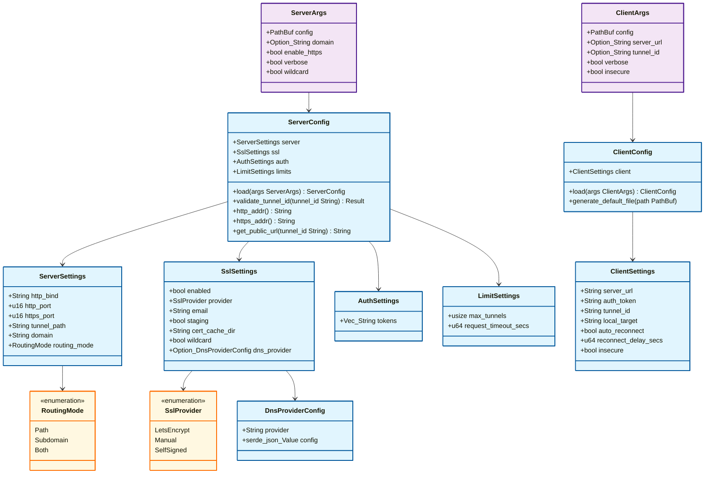
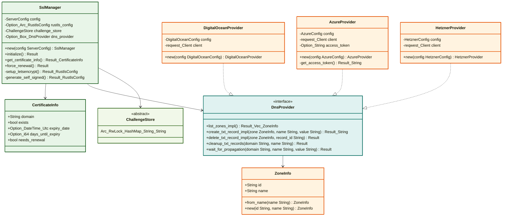
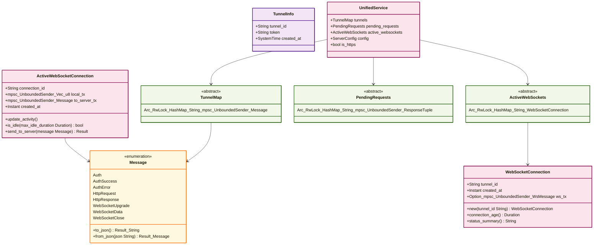

# ExposeME Architecture Diagrams

## 1. Configuration Layer

## 2. SSL & DNS Management

## 3. Protocol & Service Layer

## Architecture Overview

**🔵 Configuration Layer** - Handles all configuration management with CLI args, TOML files, and environment variables

**🟢 SSL & DNS Management** - Automatic certificate handling with Let's Encrypt integration and pluggable DNS providers

**🟣 Protocol & Service Layer** - Core tunneling logic with WebSocket communication and HTTP/WebSocket proxying
