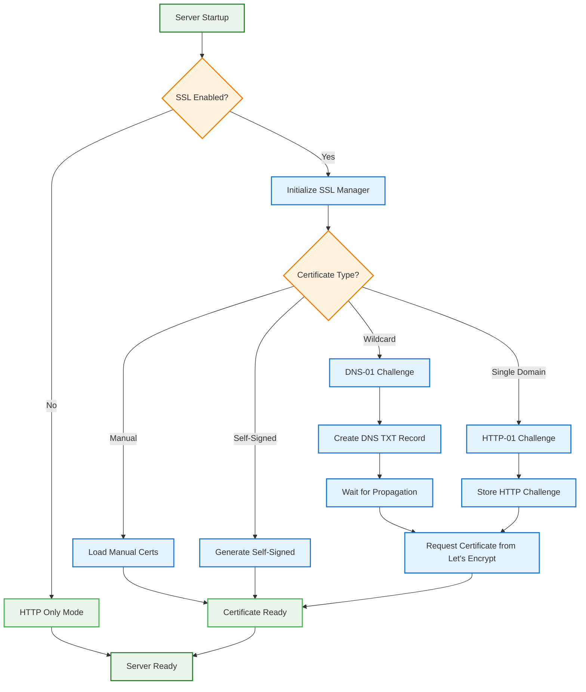
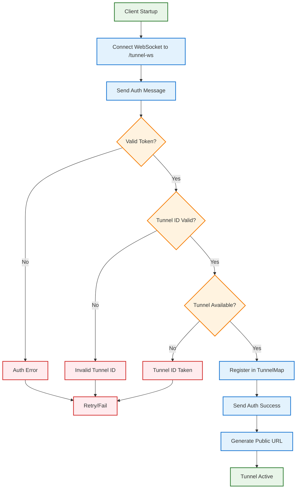
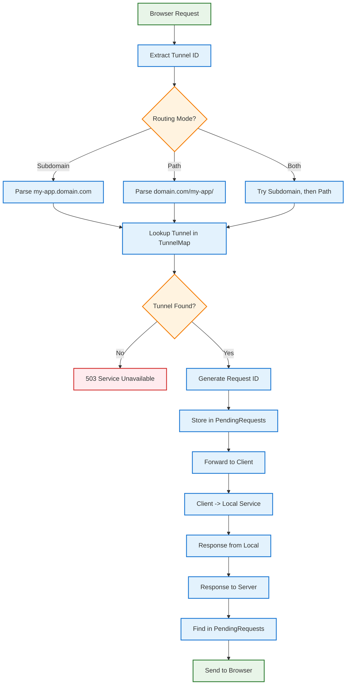
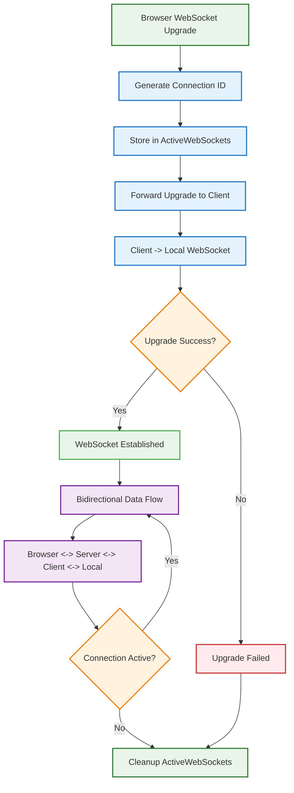
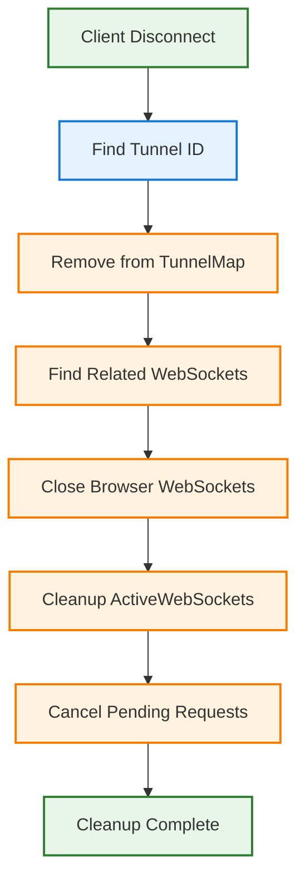

## ExposeME Process Flows

### 1. SSL Certificate Setup Flow

```mermaid
flowchart TD
    A1[Server Startup] --> A2{SSL Enabled?}
    A2 -->|Yes| A3[Initialize SSL Manager]
    A2 -->|No| A11[HTTP Only Mode]
    
    A3 --> A4{Certificate Type?}
    A4 -->|Wildcard| A5[DNS-01 Challenge]
    A4 -->|Single Domain| A6[HTTP-01 Challenge]
    A4 -->|Manual| A7[Load Manual Certs]
    A4 -->|Self-Signed| A8[Generate Self-Signed]
    
    A5 --> A9[Create DNS TXT Record]
    A9 --> A10[Wait for Propagation]
    A10 --> A12[Request Certificate from Let's Encrypt]
    
    A6 --> A13[Store HTTP Challenge]
    A13 --> A12
    
    A7 --> A14[Certificate Ready]
    A8 --> A14
    A12 --> A14
    A11 --> A15[Server Ready]
    A14 --> A15

    %% Styling
    classDef startEnd fill:#e8f5e8,stroke:#2e7d32,stroke-width:2px
    classDef process fill:#e3f2fd,stroke:#1976d2,stroke-width:2px
    classDef decision fill:#fff3e0,stroke:#f57c00,stroke-width:2px
    classDef success fill:#e8f5e8,stroke:#4caf50,stroke-width:2px

    class A1,A15 startEnd
    class A3,A5,A6,A7,A8,A9,A10,A12,A13 process
    class A2,A4 decision
    class A11,A14 success
```

### 2. Tunnel Establishment Flow

```mermaid
flowchart TD
    B1[Client Startup] --> B2[Connect WebSocket to /tunnel-ws]
    B2 --> B3[Send Auth Message]
    B3 --> B4{Valid Token?}
    
    B4 -->|No| B5[Auth Error]
    B4 -->|Yes| B6{Tunnel ID Valid?}
    
    B6 -->|No| B7[Invalid Tunnel ID]
    B6 -->|Yes| B8{Tunnel Available?}
    
    B8 -->|No| B9[Tunnel ID Taken]
    B8 -->|Yes| B10[Register in TunnelMap]
    
    B10 --> B11[Send Auth Success]
    B11 --> B12[Generate Public URL]
    B12 --> B13[Tunnel Active]
    
    B5 --> B14[Retry/Fail]
    B7 --> B14
    B9 --> B14

    %% Styling
    classDef startEnd fill:#e8f5e8,stroke:#2e7d32,stroke-width:2px
    classDef process fill:#e3f2fd,stroke:#1976d2,stroke-width:2px
    classDef decision fill:#fff3e0,stroke:#f57c00,stroke-width:2px
    classDef error fill:#ffebee,stroke:#d32f2f,stroke-width:2px
    classDef success fill:#e8f5e8,stroke:#4caf50,stroke-width:2px

    class B1,B13 startEnd
    class B2,B3,B10,B11,B12 process
    class B4,B6,B8 decision
    class B5,B7,B9,B14 error
```

### 3. HTTP Request Flow

```mermaid
flowchart TD
    C1[Browser Request] --> C2[Extract Tunnel ID]
    C2 --> C3{Routing Mode?}
    
    C3 -->|Subdomain| C4[Parse my-app.domain.com]
    C3 -->|Path| C5[Parse domain.com/my-app/ ]
    C3 -->|Both| C6[Try Subdomain, then Path]
    
    C4 --> C7[Lookup Tunnel in TunnelMap]
    C5 --> C7
    C6 --> C7
    
    C7 --> C8{Tunnel Found?}
    C8 -->|No| C9[503 Service Unavailable]
    C8 -->|Yes| C10[Generate Request ID]
    
    C10 --> C11[Store in PendingRequests]
    C11 --> C12[Forward to Client]
    C12 --> C13[Client -> Local Service]
    C13 --> C14[Response from Local]
    C14 --> C15[Response to Server]
    C15 --> C16[Find in PendingRequests]
    C16 --> C17[Send to Browser]

    %% Styling
    classDef startEnd fill:#e8f5e8,stroke:#2e7d32,stroke-width:2px
    classDef process fill:#e3f2fd,stroke:#1976d2,stroke-width:2px
    classDef decision fill:#fff3e0,stroke:#f57c00,stroke-width:2px
    classDef error fill:#ffebee,stroke:#d32f2f,stroke-width:2px
    classDef success fill:#e8f5e8,stroke:#4caf50,stroke-width:2px

    class C1,C17 startEnd
    class C2,C4,C5,C6,C7,C10,C11,C12,C13,C14,C15,C16 process
    class C3,C8 decision
    class C9 error
```

### 4. WebSocket Proxy Flow

```mermaid
flowchart TD
    D1[Browser WebSocket Upgrade] --> D2[Generate Connection ID]
    D2 --> D3[Store in ActiveWebSockets]
    D3 --> D4[Forward Upgrade to Client]
    D4 --> D5[Client -> Local WebSocket]
    D5 --> D6{Upgrade Success?}
    
    D6 -->|No| D7[Upgrade Failed]
    D6 -->|Yes| D8[WebSocket Established]
    
    D8 --> D9[Bidirectional Data Flow]
    D9 --> D10[Browser <-> Server <-> Client <-> Local]
    
    D10 --> D11{Connection Active?}
    D11 -->|Yes| D9
    D11 -->|No| D12[Cleanup ActiveWebSockets]
    
    D7 --> D12

    %% Styling
    classDef startEnd fill:#e8f5e8,stroke:#2e7d32,stroke-width:2px
    classDef process fill:#e3f2fd,stroke:#1976d2,stroke-width:2px
    classDef decision fill:#fff3e0,stroke:#f57c00,stroke-width:2px
    classDef error fill:#ffebee,stroke:#d32f2f,stroke-width:2px
    classDef success fill:#e8f5e8,stroke:#4caf50,stroke-width:2px
    classDef dataflow fill:#f3e5f5,stroke:#7b1fa2,stroke-width:2px

    class D1,D12 startEnd
    class D2,D3,D4,D5 process
    class D6,D11 decision
    class D7 error
    class D8 success
    class D9,D10 dataflow
```

### 5. Connection Cleanup Flow

```mermaid
flowchart TD
    E1[Client Disconnect] --> E2[Find Tunnel ID]
    E2 --> E3[Remove from TunnelMap]
    E3 --> E4[Find Related WebSockets]
    E4 --> E5[Close Browser WebSockets]
    E5 --> E6[Cleanup ActiveWebSockets]
    E6 --> E7[Cancel Pending Requests]
    E7 --> E8[Cleanup Complete]

    %% Styling
    classDef startEnd fill:#e8f5e8,stroke:#2e7d32,stroke-width:2px
    classDef process fill:#e3f2fd,stroke:#1976d2,stroke-width:2px
    classDef cleanup fill:#fff3e0,stroke:#f57c00,stroke-width:2px
    classDef success fill:#e8f5e8,stroke:#4caf50,stroke-width:2px

    class E1,E8 startEnd
    class E2 process
    class E3,E4,E5,E6,E7 cleanup
```