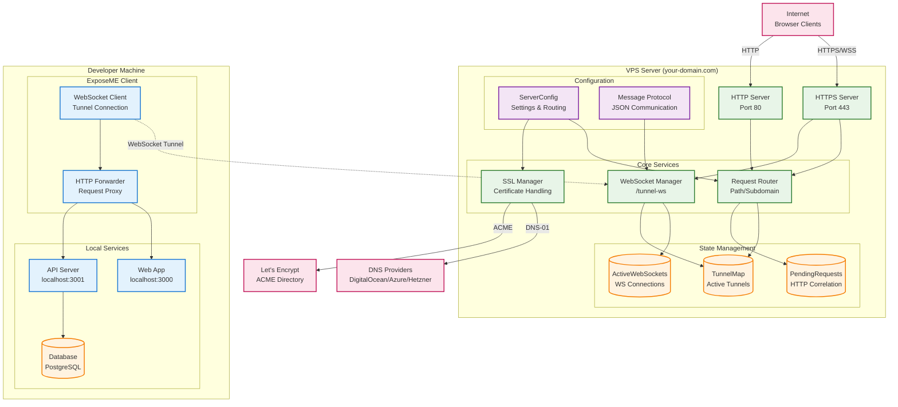

```mermaid
graph TD
%% External Layer
    Internet[Internet<br/>Browser Clients]
    DNS[DNS Providers<br/>DigitalOcean/Azure/Hetzner]
    LE[Let's Encrypt<br/>ACME Directory]

%% VPS Server - Network Layer
    subgraph VPS ["VPS Server (your-domain.com)"]
        HTTP[HTTP Server<br/>Port 80]
        HTTPS[HTTPS Server<br/>Port 443]

    %% Core Services Layer
        subgraph CoreServices ["Core Services"]
            WSMgr[WebSocket Manager<br/>/tunnel-ws]
            Router[Request Router<br/>Path/Subdomain]
            SSLMgr[SSL Manager<br/>Certificate Handling]
        end

    %% State Management Layer
        subgraph StateLayer ["State Management"]
            TunnelMap[(TunnelMap<br/>Active Tunnels)]
            PendingReq[(PendingRequests<br/>HTTP Correlation)]
            ActiveWS[(ActiveWebSockets<br/>WS Connections)]
        end

    %% Configuration Layer
        subgraph ConfigLayer ["Configuration"]
            Config[ServerConfig<br/>Settings & Routing]
            Protocol[Message Protocol<br/>JSON Communication]
        end
    end

%% Client Side
    subgraph ClientSide ["Developer Machine"]
    %% Client Services
        subgraph ClientServices ["ExposeME Client"]
            WSClient[WebSocket Client<br/>Tunnel Connection]
            HTTPForward[HTTP Forwarder<br/>Request Proxy]
        end

    %% Local Development
        subgraph LocalDev ["Local Services"]
            WebApp[Web App<br/>localhost:3000]
            API[API Server<br/>localhost:3001]
            DB[(Database<br/>PostgreSQL)]
        end
    end

%% External connections
    Internet -->|HTTPS/WSS| HTTPS
    Internet -->|HTTP| HTTP

%% SSL connections
    SSLMgr -->|DNS-01| DNS
    SSLMgr -->|ACME| LE

%% Server internal flow
    HTTP --> Router
    HTTPS --> Router
    HTTPS --> WSMgr

    Router --> TunnelMap
    Router --> PendingReq
    WSMgr --> ActiveWS
    WSMgr --> TunnelMap

%% Configuration
    Config --> Router
    Config --> SSLMgr
    Protocol --> WSMgr

%% Client tunnel connection
    WSClient -.->|WebSocket Tunnel| WSMgr

%% Client internal connections
    WSClient --> HTTPForward
    HTTPForward --> WebApp
    HTTPForward --> API
    API --> DB

%% Styling
    classDef external fill:#fce4ec,stroke:#c2185b,stroke-width:2px
    classDef server fill:#e8f5e8,stroke:#2e7d32,stroke-width:2px
    classDef client fill:#e3f2fd,stroke:#1976d2,stroke-width:2px
    classDef data fill:#fff3e0,stroke:#f57c00,stroke-width:2px
    classDef config fill:#f3e5f5,stroke:#7b1fa2,stroke-width:2px

    class Internet,DNS,LE external
    class HTTP,HTTPS,WSMgr,Router,SSLMgr server
    class WSClient,HTTPForward,WebApp,API client
    class TunnelMap,PendingReq,ActiveWS,DB data
    class Config,Protocol config
```