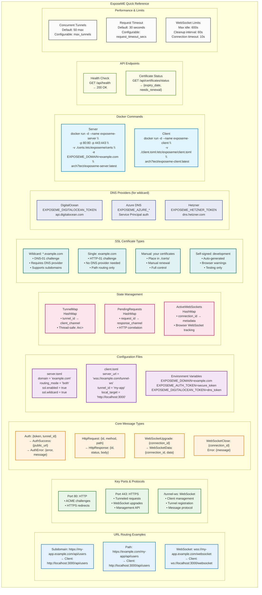

```mermaid
graph TB
    subgraph "ExposeME Quick Reference"

        subgraph "URL Routing Examples"
            URL1["Subdomain: https://my-app.example.com/api/users<br/>→ Client: http://localhost:3000/api/users"]
            URL2["Path: https://example.com/my-app/api/users<br/>→ Client: http://localhost:3000/api/users"]
            URL3["WebSocket: wss://my-app.example.com/websocket<br/>→ Client: ws://localhost:3000/websocket"]
        end

        subgraph "Key Ports & Protocols"
            P80["Port 80: HTTP<br/>• ACME challenges<br/>• HTTPS redirects"]
            P443["Port 443: HTTPS<br/>• Tunneled requests<br/>• WebSocket upgrades<br/>• Management API"]
            WSP["/tunnel-ws: WebSocket<br/>• Client management<br/>• Tunnel registration<br/>• Message protocol"]
        end

        subgraph "Core Message Types"
            MSG1["Auth: {token, tunnel_id}<br/>→ AuthSuccess: {public_url}<br/>→ AuthError: {error, message}"]
            MSG2["HttpRequest: {id, method, path}<br/>→ HttpResponse: {id, status, body}"]
            MSG3["WebSocketUpgrade: {connection_id}<br/>→ WebSocketData: {connection_id, data}"]
            MSG4["WebSocketClose: {connection_id}<br/>Error: {message}"]
        end

        subgraph "Configuration Files"
            SCONF["server.toml<br/>domain = 'example.com'<br/>routing_mode = 'both'<br/>ssl.enabled = true<br/>ssl.wildcard = true"]
            CCONF["client.toml<br/>server_url = 'wss://example.com/tunnel-ws'<br/>tunnel_id = 'my-app'<br/>local_target = 'http://localhost:3000'"]
            ENV["Environment Variables<br/>EXPOSEME_DOMAIN=example.com<br/>EXPOSEME_AUTH_TOKEN=secure_token<br/>EXPOSEME_DIGITALOCEAN_TOKEN=dns_token"]
        end

        subgraph "State Management"
            TM["TunnelMap<br/>HashMap<String, Sender><br/>• tunnel_id → client_channel<br/>• Thread-safe: Arc<RwLock<>>"]
            PR["PendingRequests<br/>HashMap<String, Sender><br/>• request_id → response_channel<br/>• HTTP correlation"]
            AWS["ActiveWebSockets<br/>HashMap<String, WSConnection><br/>• connection_id → metadata<br/>• Browser WebSocket tracking"]
        end

        subgraph "SSL Certificate Types"
            SSL1["Wildcard: *.example.com<br/>• DNS-01 challenge<br/>• Requires DNS provider<br/>• Supports subdomains"]
            SSL2["Single: example.com<br/>• HTTP-01 challenge<br/>• No DNS provider needed<br/>• Path routing only"]
            SSL3["Manual: your certificates<br/>• Place in ./certs/<br/>• Manual renewal<br/>• Full control"]
            SSL4["Self-signed: development<br/>• Auto-generated<br/>• Browser warnings<br/>• Testing only"]
        end

        subgraph "DNS Providers (for wildcard)"
            DNS1["DigitalOcean<br/>EXPOSEME_DIGITALOCEAN_TOKEN<br/>api.digitalocean.com"]
            DNS2["Azure DNS<br/>EXPOSEME_AZURE_*<br/>Service Principal auth"]
            DNS3["Hetzner<br/>EXPOSEME_HETZNER_TOKEN<br/>dns.hetzner.com"]
        end

        subgraph "Docker Commands"
            DC1["Server<br/>docker run -d --name exposeme-server \\<br/>  -p 80:80 -p 443:443 \\<br/>  -v ./certs:/etc/exposeme/certs \\<br/>  -e EXPOSEME_DOMAIN=example.com \\<br/>  arch7tect/exposeme-server:latest"]
            DC2["Client<br/>docker run -d --name exposeme-client \\<br/>  -v ./client.toml:/etc/exposeme/client.toml \\<br/>  arch7tect/exposeme-client:latest"]
        end


        subgraph "API Endpoints"
            API1["Health Check<br/>GET /api/health<br/>→ 200 OK"]
            API2["Certificate Status<br/>GET /api/certificates/status<br/>→ {expiry_date, needs_renewal}"]
        end

        subgraph "Performance & Limits"
            PERF1["Concurrent Tunnels<br/>Default: 50 max<br/>Configurable: max_tunnels"]
            PERF2["Request Timeout<br/>Default: 30 seconds<br/>Configurable: request_timeout_secs"]
            PERF3["WebSocket Limits<br/>Max idle: 600s<br/>Cleanup interval: 60s<br/>Connection timeout: 10s"]
        end
    end

%% Styling
    classDef urls fill:#e3f2fd,stroke:#1976d2,stroke-width:2px
    classDef ports fill:#e8f5e8,stroke:#2e7d32,stroke-width:2px  
    classDef messages fill:#fff3e0,stroke:#f57c00,stroke-width:2px
    classDef config fill:#f3e5f5,stroke:#7b1fa2,stroke-width:2px
    classDef state fill:#fce4ec,stroke:#c2185b,stroke-width:2px
    classDef ssl fill:#e0f2f1,stroke:#00695c,stroke-width:2px
    classDef dns fill:#e8eaf6,stroke:#3f51b5,stroke-width:2px
    classDef docker fill:#e1f5fe,stroke:#0277bd,stroke-width:2px
    classDef api fill:#f9fbe7,stroke:#689f38,stroke-width:2px
    classDef perf fill:#fafafa,stroke:#616161,stroke-width:2px

    class URL1,URL2,URL3 urls
    class P80,P443,WSP ports
    class MSG1,MSG2,MSG3,MSG4 messages
    class SCONF,CCONF,ENV config
    class TM,PR,AWS state
    class SSL1,SSL2,SSL3,SSL4 ssl
    class DNS1,DNS2,DNS3 dns
    class DC1,DC2 docker
    class API1,API2 api
    class PERF1,PERF2,PERF3 perf
```