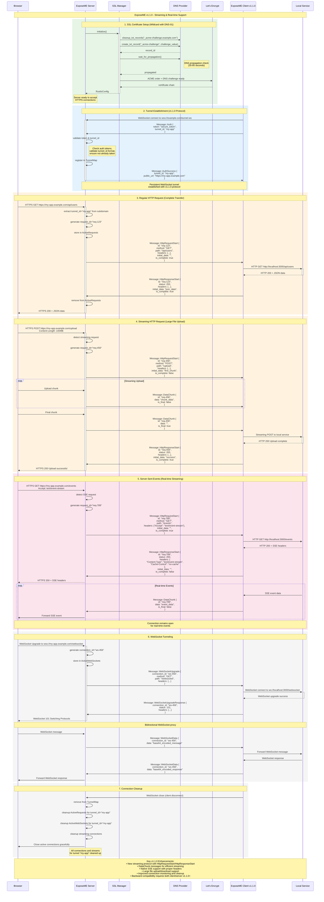

```mermaid
sequenceDiagram
    participant Browser
    participant Server as ExposeME Server
    participant SSL as SSL Manager
    participant DNS as DNS Provider
    participant LE as Let's Encrypt
    participant Client as ExposeME Client v1.1.0
    participant Local as Local Service

    Note over Browser,Local: ExposeME v1.1.0 - Streaming & Real-time Support

%% SSL Certificate Setup
    rect rgb(230, 245, 230)
        Note over Server,LE: 1. SSL Certificate Setup (Wildcard with DNS-01)

        Server->>+SSL: initialize()
        SSL->>DNS: cleanup_txt_records("_acme-challenge.example.com")
        SSL->>DNS: create_txt_record("_acme-challenge", challenge_value)
        DNS-->>SSL: record_id

        SSL->>DNS: wait_for_propagation()
        Note right of DNS: DNS propagation check<br/>(30-60 seconds)
        DNS-->>SSL: propagated

        SSL->>LE: ACME order + DNS challenge ready
        LE-->>SSL: certificate chain
        SSL-->>-Server: RustlsConfig

        Note over Server: Server ready to accept<br/>HTTPS connections
    end

%% Tunnel Establishment
    rect rgb(227, 242, 253)
        Note over Client,Server: 2. Tunnel Establishment (v1.1.0 Protocol)

        Client->>+Server: WebSocket connect to wss://example.com/tunnel-ws
        Client->>Server: Message::Auth {<br/>  token: "secure_token",<br/>  tunnel_id: "my-app"<br/>}

        Server->>Server: validate token & tunnel_id
        Note right of Server: Check auth tokens,<br/>validate tunnel_id format,<br/>ensure not already taken

        Server->>Server: register in TunnelMap
        Server-->>-Client: Message::AuthSuccess {<br/>  tunnel_id: "my-app",<br/>  public_url: "https://my-app.example.com"<br/>}

        Note over Client,Server: Persistent WebSocket tunnel<br/>established with v1.1.0 protocol
    end

%% Regular HTTP Request (Complete)
    rect rgb(255, 243, 224)
        Note over Browser,Local: 3. Regular HTTP Request (Complete Transfer)

        Browser->>+Server: HTTPS GET https://my-app.example.com/api/users

        Server->>Server: extract tunnel_id="my-app" from subdomain
        Server->>Server: generate request_id="req-123"
        Server->>Server: store in ActiveRequests

        Server->>Client: Message::HttpRequestStart {<br/>  id: "req-123",<br/>  method: "GET",<br/>  path: "/api/users",<br/>  headers: {...},<br/>  initial_data: "",<br/>  is_complete: true<br/>}

        Client->>+Local: HTTP GET http://localhost:3000/api/users
        Local-->>-Client: HTTP 200 + JSON data

        Client->>Server: Message::HttpResponseStart {<br/>  id: "req-123",<br/>  status: 200,<br/>  headers: {...},<br/>  initial_data: "json_data",<br/>  is_complete: true<br/>}

        Server->>Server: remove from ActiveRequests
        Server-->>-Browser: HTTPS 200 + JSON data
    end

%% Streaming HTTP Request (Large File Upload)
    rect rgb(255, 243, 224)
        Note over Browser,Local: 4. Streaming HTTP Request (Large File Upload)

        Browser->>+Server: HTTPS POST https://my-app.example.com/upload<br/>Content-Length: 100MB

        Server->>Server: detect streaming request
        Server->>Server: generate request_id="req-456"

        Server->>Client: Message::HttpRequestStart {<br/>  id: "req-456",<br/>  method: "POST",<br/>  path: "/upload",<br/>  headers: {...},<br/>  initial_data: "first_chunk",<br/>  is_complete: false<br/>}

        loop Streaming Upload
            Browser->>Server: Upload chunk
            Server->>Client: Message::DataChunk {<br/>  id: "req-456",<br/>  data: "chunk_data",<br/>  is_final: false<br/>}
        end

        Browser->>Server: Final chunk
        Server->>Client: Message::DataChunk {<br/>  id: "req-456",<br/>  data: "",<br/>  is_final: true<br/>}

        Client->>+Local: Streaming POST to local service
        Local-->>-Client: HTTP 200 Upload complete

        Client->>Server: Message::HttpResponseStart {<br/>  id: "req-456",<br/>  status: 200,<br/>  headers: {...},<br/>  initial_data: "success",<br/>  is_complete: true<br/>}

        Server-->>-Browser: HTTPS 200 Upload successful
    end

%% Server-Sent Events (SSE)
    rect rgb(252, 228, 236)
        Note over Browser,Local: 5. Server-Sent Events (Real-time Streaming)

        Browser->>+Server: HTTPS GET https://my-app.example.com/events<br/>Accept: text/event-stream

        Server->>Server: detect SSE request
        Server->>Server: generate request_id="req-789"

        Server->>Client: Message::HttpRequestStart {<br/>  id: "req-789",<br/>  method: "GET",<br/>  path: "/events",<br/>  headers: {"Accept": "text/event-stream"},<br/>  initial_data: "",<br/>  is_complete: true<br/>}

        Client->>+Local: HTTP GET http://localhost:3000/events
        Local-->>Client: HTTP 200 + SSE headers

        Client->>Server: Message::HttpResponseStart {<br/>  id: "req-789",<br/>  status: 200,<br/>  headers: {<br/>    "Content-Type": "text/event-stream",<br/>    "Cache-Control": "no-cache"<br/>  },<br/>  initial_data: "",<br/>  is_complete: false<br/>}

        Server-->>Browser: HTTPS 200 + SSE headers

        loop Real-time Events
            Local->>Client: SSE event data
            Client->>Server: Message::DataChunk {<br/>  id: "req-789",<br/>  data: "event_data",<br/>  is_final: false<br/>}
            Server->>Browser: Forward SSE event
        end

        Note over Browser,Local: Connection remains open<br/>for real-time events
    end

%% WebSocket Tunneling
    rect rgb(245, 245, 245)
        Note over Browser,Local: 6. WebSocket Tunneling

        Browser->>+Server: WebSocket Upgrade to wss://my-app.example.com/websocket

        Server->>Server: generate connection_id="ws-456"
        Server->>Server: store in ActiveWebSockets

        Server->>Client: Message::WebSocketUpgrade {<br/>  connection_id: "ws-456",<br/>  method: "GET",<br/>  path: "/websocket",<br/>  headers: {...}<br/>}

        Client->>+Local: WebSocket connect to ws://localhost:3000/websocket
        Local-->>-Client: WebSocket upgrade success

        Client->>Server: Message::WebSocketUpgradeResponse {<br/>  connection_id: "ws-456",<br/>  status: 101,<br/>  headers: {...}<br/>}

        Server-->>-Browser: WebSocket 101 Switching Protocols

        Note over Browser,Local: Bidirectional WebSocket proxy

    %% Data flow examples
        Browser->>Server: WebSocket message
        Server->>Client: Message::WebSocketData {<br/>  connection_id: "ws-456",<br/>  data: "base64_encoded_message"<br/>}
        Client->>Local: Forward WebSocket message
        Local->>Client: WebSocket response
        Client->>Server: Message::WebSocketData {<br/>  connection_id: "ws-456",<br/>  data: "base64_encoded_response"<br/>}
        Server->>Browser: Forward WebSocket response
    end

%% Connection Cleanup
    rect rgb(245, 245, 245)
        Note over Client,Browser: 7. Connection Cleanup

        Client->>Server: WebSocket close (client disconnect)

        Server->>Server: remove from TunnelMap
        Server->>Server: cleanup ActiveRequests for tunnel_id="my-app"
        Server->>Server: cleanup ActiveWebSockets for tunnel_id="my-app"
        Server->>Server: cleanup streaming connections
        Server->>Browser: Close active connections gracefully

        Note over Server: All connections and streams<br/>for tunnel "my-app" cleaned up
    end

    Note over Browser,Local: Key v1.1.0 Enhancements:<br/>• New streaming protocol with HttpRequestStart/HttpResponseStart<br/>• DataChunk messages for efficient streaming<br/>• Native SSE support with proper headers<br/>• Large file upload/download support<br/>• Improved connection monitoring and cleanup<br/>• Backward compatibility requires both client/server v1.1.0+
```