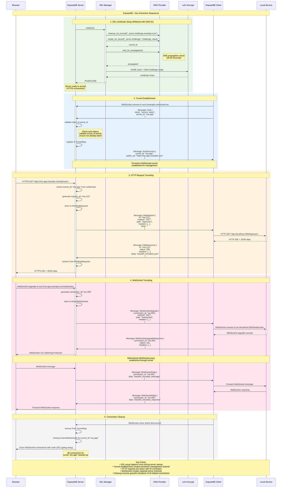

```mermaid
sequenceDiagram
    participant Browser
    participant Server as ExposeME Server
    participant SSL as SSL Manager
    participant DNS as DNS Provider
    participant LE as Let's Encrypt
    participant Client as ExposeME Client
    participant Local as Local Service

    Note over Browser,Local: ExposeME - Key Interaction Sequences

    %% SSL Certificate Setup
    rect rgb(230, 245, 230)
        Note over Server,LE: 1. SSL Certificate Setup (Wildcard with DNS-01)
        
        Server->>+SSL: initialize()
        SSL->>DNS: cleanup_txt_records("_acme-challenge.example.com")
        SSL->>DNS: create_txt_record("_acme-challenge", challenge_value)
        DNS-->>SSL: record_id
        
        SSL->>DNS: wait_for_propagation()
        Note right of DNS: DNS propagation check<br/>(30-60 seconds)
        DNS-->>SSL: propagated
        
        SSL->>LE: ACME order + DNS challenge ready
        LE-->>SSL: certificate chain
        SSL-->>-Server: RustlsConfig
        
        Note over Server: Server ready to accept<br/>HTTPS connections
    end

    %% Tunnel Establishment
    rect rgb(227, 242, 253)
        Note over Client,Server: 2. Tunnel Establishment
        
        Client->>+Server: WebSocket connect to wss://example.com/tunnel-ws
        Client->>Server: Message::Auth {<br/>  token: "secure_token",<br/>  tunnel_id: "my-app"<br/>}
        
        Server->>Server: validate token & tunnel_id
        Note right of Server: Check auth tokens,<br/>validate tunnel_id format,<br/>ensure not already taken
        
        Server->>Server: register in TunnelMap
        Server-->>-Client: Message::AuthSuccess {<br/>  tunnel_id: "my-app",<br/>  public_url: "https://my-app.example.com"<br/>}
        
        Note over Client,Server: Persistent WebSocket tunnel<br/>established for management
    end

    %% HTTP Request Tunneling
    rect rgb(255, 243, 224)
        Note over Browser,Local: 3. HTTP Request Tunneling
        
        Browser->>+Server: HTTPS GET https://my-app.example.com/api/users
        
        Server->>Server: extract tunnel_id="my-app" from subdomain
        Server->>Server: generate request_id="req-123"
        Server->>Server: store in PendingRequests
        
        Server->>Client: Message::HttpRequest {<br/>  id: "req-123",<br/>  method: "GET",<br/>  path: "/api/users",<br/>  headers: {...},<br/>  body: ""<br/>}
        
        Client->>+Local: HTTP GET http://localhost:3000/api/users
        Local-->>-Client: HTTP 200 + JSON data
        
        Client->>Server: Message::HttpResponse {<br/>  id: "req-123",<br/>  status: 200,<br/>  headers: {...},<br/>  body: "base64_encoded_json"<br/>}
        
        Server->>Server: remove from PendingRequests
        Server-->>-Browser: HTTPS 200 + JSON data
    end

    %% WebSocket Tunneling
    rect rgb(252, 228, 236)
        Note over Browser,Local: 4. WebSocket Tunneling
        
        Browser->>+Server: WebSocket Upgrade to wss://my-app.example.com/websocket
        
        Server->>Server: generate connection_id="ws-456"
        Server->>Server: store in ActiveWebSockets
        
        Server->>Client: Message::WebSocketUpgrade {<br/>  connection_id: "ws-456",<br/>  method: "GET",<br/>  path: "/websocket",<br/>  headers: {...}<br/>}
        
        Client->>+Local: WebSocket connect to ws://localhost:3000/websocket
        Local-->>-Client: WebSocket upgrade success
        
        Client->>Server: Message::WebSocketUpgradeResponse {<br/>  connection_id: "ws-456",<br/>  status: 101,<br/>  headers: {...}<br/>}
        
        Server-->>-Browser: WebSocket 101 Switching Protocols
        
        Note over Browser,Local: Bidirectional WebSocket proxy<br/>established through tunnel
        
        %% Data flow examples
        Browser->>Server: WebSocket message
        Server->>Client: Message::WebSocketData {<br/>  connection_id: "ws-456",<br/>  data: "base64_encoded_message"<br/>}
        Client->>Local: Forward WebSocket message
        Local->>Client: WebSocket response
        Client->>Server: Message::WebSocketData {<br/>  connection_id: "ws-456",<br/>  data: "base64_encoded_response"<br/>}
        Server->>Browser: Forward WebSocket response
    end

    %% Connection Cleanup
    rect rgb(245, 245, 245)
        Note over Client,Browser: 5. Connection Cleanup
        
        Client->>Server: WebSocket close (client disconnect)
        
        Server->>Server: remove from TunnelMap
        Server->>Server: cleanup ActiveWebSockets for tunnel_id="my-app"
        Server->>Browser: Close WebSocket connections with code 1001 (going away)
        
        Note over Server: All connections for<br/>tunnel "my-app" cleaned up
    end

    Note over Browser,Local: Key Points:<br/>• SSL setup happens once during server startup<br/>• Tunnel establishment creates persistent management channel<br/>• HTTP requests are async with ID correlation<br/>• WebSocket creates separate proxy channels<br/>• Cleanup ensures graceful shutdown of all related connections
```