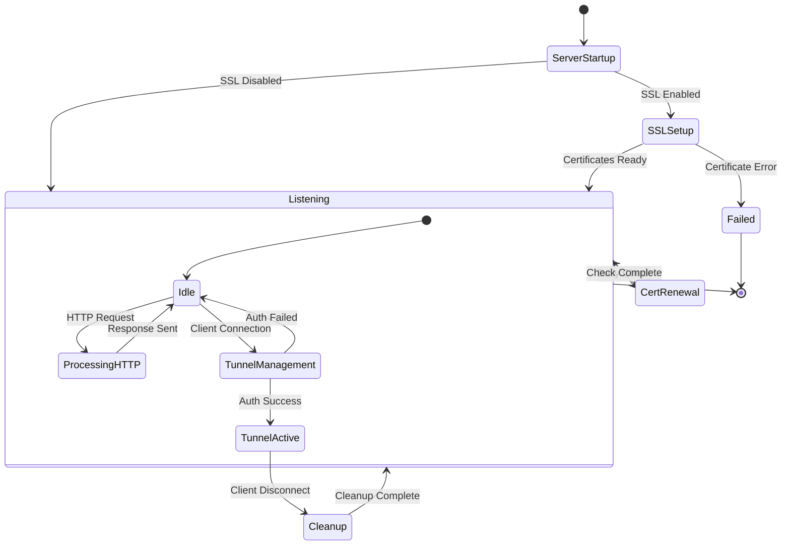
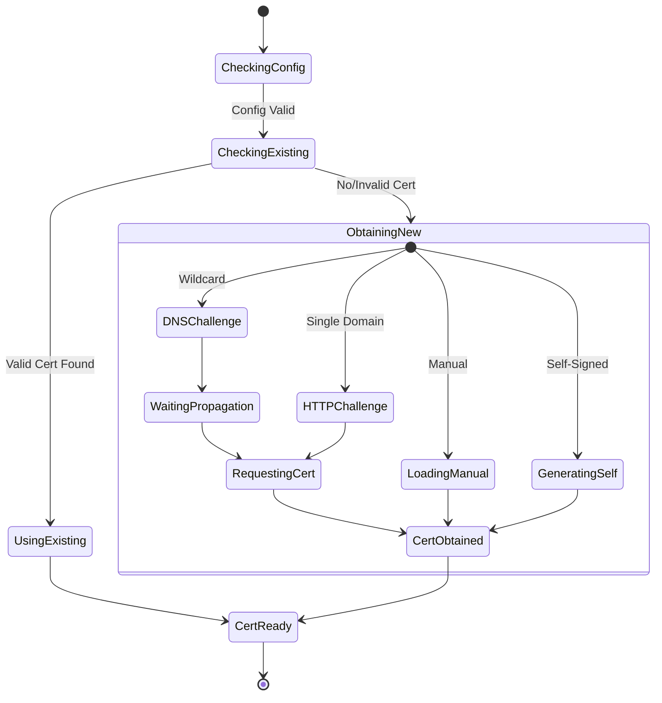
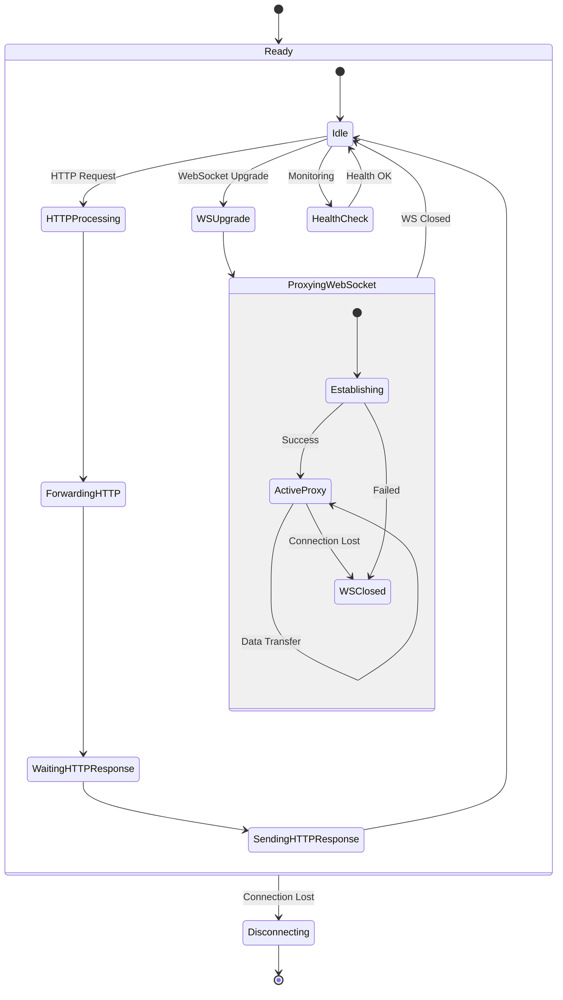
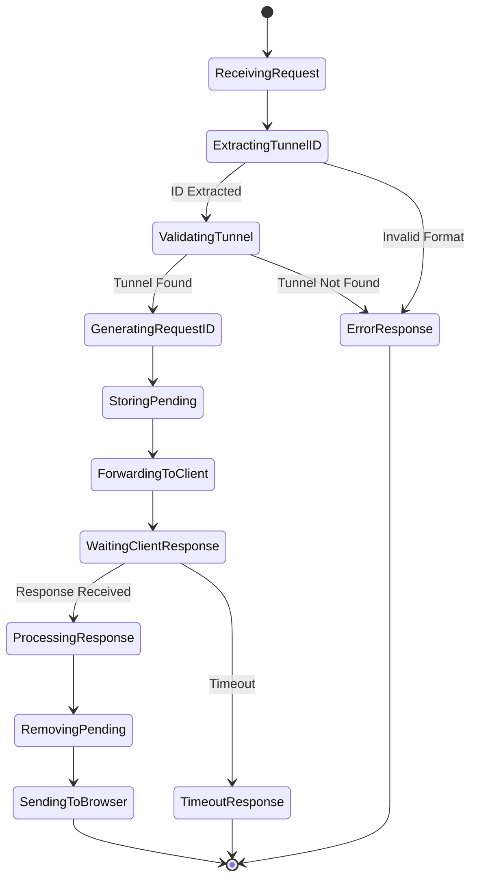
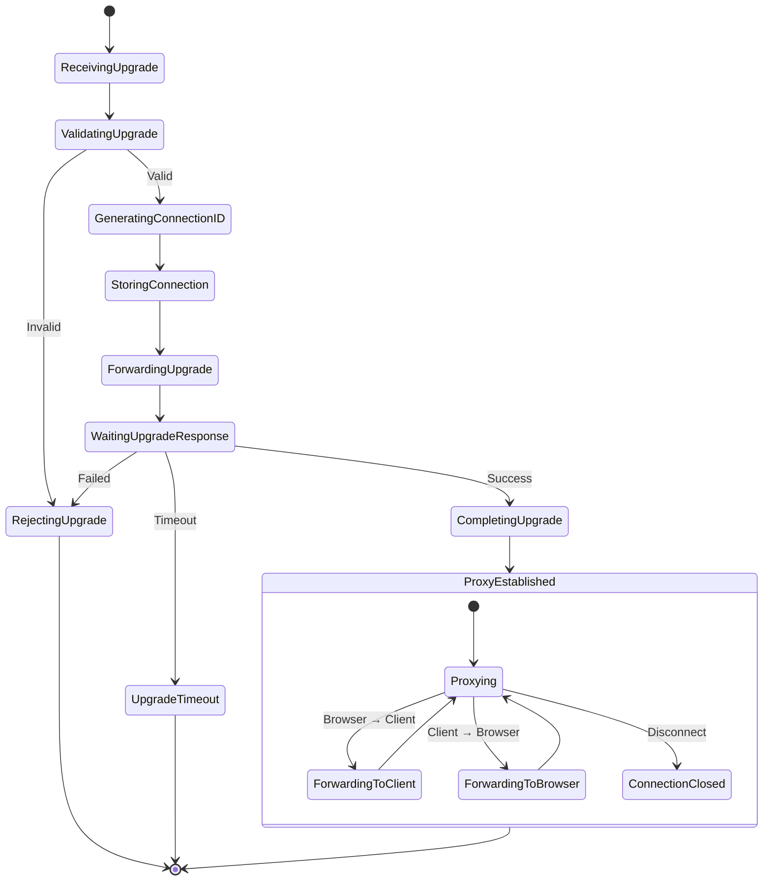
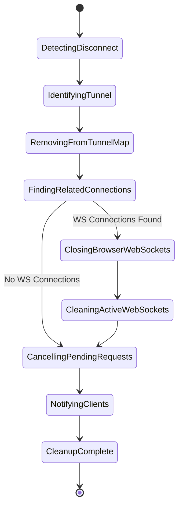

## ExposeME State Diagrams

### Main Application States
The main diagram shows the **high-level application lifecycle** and **primary state transitions** that users and operators care about.

### SSL Setup Details (SSLSetup state breakdown)
Certificate acquisition and validation process

### Tunnel Active Details (TunnelActive state breakdown)
Active tunnel request handling and monitoring

### HTTP Request Processing Details
Detailed request/response correlation flow

### WebSocket Upgrade Flow Details
WebSocket proxy establishment process

### Cleanup Process Details
Resource cleanup and graceful shutdown

